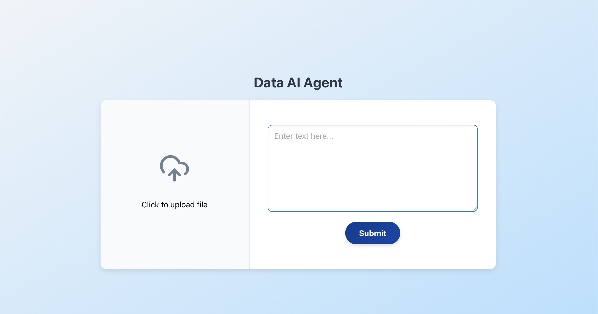

# Data AI Agent



## Project Overview
The **Data AI Agent** is a web application designed for seamless file uploads and text input via an intuitive user interface. Built with **React (TypeScript)** on the frontend, the application is structured for easy integration with a backend to support file processing and storage.

## Features
- **File Upload**: Users can upload files using the left panel.
- **Text Input**: Users can enter text via the right panel.
- **Modern UI**: A responsive, sleek interface powered by Tailwind CSS.
- **Enhanced Usability**: Smooth animations and transitions for a better user experience.

## Technology Stack
### Frontend (React + TypeScript)
- **React (TypeScript)**
- **Tailwind CSS** (for styling)
- **Lucide React** (for icons)

## Folder Structure
```
├── 📂 src
│   ├── 📂 components
│   │   ├── FileTextUploader.tsx   # Component for file upload and text input
│   │   ├── styles.css             # Custom UI styles
│   ├── 📂 pages
│   │   ├── Home.tsx               # Main landing page
│   ├── App.tsx                    # Main application component
│   ├── index.tsx                  # Entry point for React app
│   ├── package.json                # Project dependencies
│   ├── README.md                   # Documentation
```

## Installation & Setup
### Prerequisites
- **Node.js** (v16 or higher)

### Setup
1. Clone the repository:
   ```sh
   git clone https://github.com/your-repo/data-ai-agent.git
   cd frontend
   ```
2. Install dependencies:
   ```sh
   npm install
   ```
3. Start the development server:
   ```sh
   npm start
   ```

## Future Enhancements
- ✅ Backend integration for file processing.
- ✅ Dark mode support.
- ✅ Drag-and-drop file upload.
- ✅ AI-powered text analysis.

This project lays the foundation for AI-driven file and text processing applications. 🚀

